# OneBusAway Module Dependency Graph

This document shows the inter-module dependencies in the OneBusAway Application Modules project.

## Dependency Graph

```mermaid
graph TD
    subgraph "Infrastructure Layer"
        core[onebusaway-core]
        realtime-api[onebusaway-realtime-api]
        alerts-api[onebusaway-alerts-api]
    end

    subgraph "Container & Utilities"
        container[onebusaway-container]
        util[onebusaway-util]
        geospatial[onebusaway-geospatial]
    end

    subgraph "Data Layer"
        federations[onebusaway-federations]
        transit-data[onebusaway-transit-data]
        gtfs-hibernate[onebusaway-gtfs-hibernate-spring]
        gtfs-rt-model[onebusaway-gtfs-realtime-model]
    end

    subgraph "Service Layer"
        api-core[onebusaway-api-core]
        users[onebusaway-users]
        alerts-persist[onebusaway-alerts-persistence]
        geocoder[onebusaway-geocoder]
        agency-meta[onebusaway-agency-metadata]
    end

    subgraph "Federation Layer"
        tdf[onebusaway-transit-data-federation]
        tdf-builder[onebusaway-transit-data-federation-builder]
    end

    subgraph "Presentation Layer"
        presentation[onebusaway-presentation]
    end

    subgraph "Web Applications"
        api-webapp[onebusaway-api-webapp]
        tdf-webapp[onebusaway-transit-data-federation-webapp]
        gtfs-rt-archiver[onebusaway-gtfs-realtime-archiver]
        watchdog[onebusaway-watchdog-webapp]
        twilio[onebusaway-twilio-webapp]
        fed-webapp[onebusaway-federations-webapp]
    end

    subgraph "CLI Tools"
        api-key-cli[onebusaway-api-key-cli]
    end

    subgraph "Integration Tests"
        gtfsrt-tests[onebusaway-gtfsrt-integration-tests]
    end

    %% Infrastructure dependencies
    container --> core
    geospatial --> core

    %% Utility dependencies
    util --> container
    util --> realtime-api

    %% Federations dependencies
    federations --> geospatial
    federations --> util

    %% Transit data dependencies
    transit-data --> federations
    transit-data --> realtime-api
    transit-data --> util

    %% GTFS dependencies
    gtfs-hibernate --> container
    gtfs-rt-model --> container

    %% Service layer dependencies
    api-core --> transit-data
    users --> container
    users --> util
    agency-meta --> container
    geocoder --> container
    geocoder --> geospatial
    geocoder --> util

    %% Alerts dependencies
    alerts-persist --> alerts-api
    alerts-persist --> container
    alerts-persist --> realtime-api
    alerts-persist --> transit-data

    %% Transit Data Federation dependencies
    tdf --> alerts-persist
    tdf --> api-core
    tdf --> container
    tdf --> realtime-api
    tdf --> transit-data
    tdf --> util

    tdf-builder --> gtfs-hibernate
    tdf-builder --> tdf

    %% Presentation dependencies
    presentation --> geocoder
    presentation --> transit-data
    presentation --> tdf
    presentation --> users
    presentation --> util

    %% Web application dependencies
    api-webapp --> agency-meta
    api-webapp --> api-core
    api-webapp --> presentation
    api-webapp --> tdf

    tdf-webapp --> tdf

    gtfs-rt-archiver --> alerts-persist
    gtfs-rt-archiver --> container
    gtfs-rt-archiver --> gtfs-rt-model
    gtfs-rt-archiver --> tdf
    gtfs-rt-archiver --> users

    watchdog --> tdf
    watchdog --> util

    twilio --> presentation

    fed-webapp --> federations

    %% CLI dependencies
    api-key-cli --> container
    api-key-cli --> users

    %% Integration test dependencies
    gtfsrt-tests --> tdf
    gtfsrt-tests --> tdf-builder

    %% Styling
    classDef infra fill:#e1f5fe,stroke:#01579b
    classDef container fill:#f3e5f5,stroke:#4a148c
    classDef data fill:#e8f5e9,stroke:#1b5e20
    classDef service fill:#fff3e0,stroke:#e65100
    classDef federation fill:#fce4ec,stroke:#880e4f
    classDef presentation fill:#f1f8e9,stroke:#33691e
    classDef webapp fill:#e3f2fd,stroke:#0d47a1
    classDef cli fill:#fff8e1,stroke:#ff6f00
    classDef test fill:#eceff1,stroke:#37474f

    class core,realtime-api,alerts-api infra
    class container,util,geospatial container
    class federations,transit-data,gtfs-hibernate,gtfs-rt-model data
    class api-core,users,alerts-persist,geocoder,agency-meta service
    class tdf,tdf-builder federation
    class presentation presentation
    class api-webapp,tdf-webapp,gtfs-rt-archiver,watchdog,twilio,fed-webapp webapp
    class api-key-cli cli
    class gtfsrt-tests test
```

## Module Summary

| Layer | Modules | Description |
|-------|---------|-------------|
| **Infrastructure** | `core`, `realtime-api`, `alerts-api` | Base classes with no internal dependencies |
| **Container & Utilities** | `container`, `util`, `geospatial` | Spring bootstrap, utilities, GIS functions |
| **Data Layer** | `federations`, `transit-data`, `gtfs-hibernate-spring`, `gtfs-realtime-model` | Domain models and data access |
| **Service Layer** | `api-core`, `users`, `alerts-persistence`, `geocoder`, `agency-metadata` | Business logic and services |
| **Federation Layer** | `transit-data-federation`, `transit-data-federation-builder` | Core data aggregation engine |
| **Presentation** | `presentation` | Shared UI components |
| **Web Applications** | `api-webapp`, `transit-data-federation-webapp`, `gtfs-realtime-archiver`, `watchdog-webapp`, `twilio-webapp`, `federations-webapp` | WAR deployables |
| **CLI Tools** | `api-key-cli` | Command-line utilities |

## Key Dependencies

- **Most depended-on modules:**
  - `onebusaway-container` (9 dependents)
  - `onebusaway-util` (7 dependents)
  - `onebusaway-transit-data-federation` (5 dependents)
  - `onebusaway-transit-data` (5 dependents)
  - `onebusaway-realtime-api` (5 dependents)
